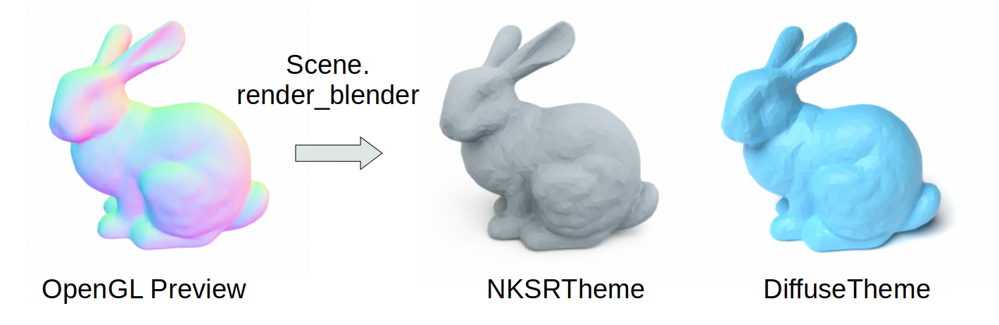

# PyCG: Toolbox for CG-related visualizations and computations

[](https://github.com/heiwang1997/pycg/actions/workflows/publish.yml)
[](https://pycg.readthedocs.io/en/latest/?badge=latest)

PyCG is there for people to accelerate their 3D visualizations and computations, aiming at implementing complicated functions with as few lines as possible.
The toolbox is created from the perspective of researchers and would hopefully accelerate your daily pipeline.

## Install

To install a full-fledged version, use:
```bash
pip install -U python-pycg[full] -f https://pycg.huangjh.tech/packages/index.html
```

> Note that the need for the extra index URL if for our [customized version of Open3D](https://github.com/heiwang1997/Open3D) (with support for multi-window camera/light synchronization, animation maker and visualizer, scalar analyzer, etc).

If you don't want to use our customized Open3D, simply do:
```shell
pip install -U python-pycg[all]
```

By default, Open3D will not be installed if you do `pip install python-pycg` directly, but all other non-visualization-related functions should work!

For developers, clone this repository and install it if you want to use newest features:
```shell
git clone --recursive https://github.com/heiwang1997/pycg
pip install -e .[full]      # Most modern, but some static analyzing tool (e.g. pylance) will fail!
                            #   Now it will create weird __editable__.*.pth files!
python setup.py develop     # Deprecated by the community, but it works better.
```

## Using PyCG

PyCG contains many submodules which could be easily imported via `from pycg import xxx`.
These different modules span a wide range of functionalities from visualizing 3D assets to creating nice html tables for comparing results.
Please refer to the individual documentation of each submodule to get started.

- 3D Visualization `pycg.vis`
- Render 3D Scenes `pycg.render`
- Handling 3D Transformations `pycg.isometry`
- Compress Videos `pycg.video`
- Compress PDF Files `pycg.pdf`
- Experiment Utilities `pycg.exp`
- Manipulating Images `pycg.image`
- ... and so on to be added!

## Gallery



<video src="https://github.com/heiwang1997/pycg/raw/master/docs/demo/scene_show.mp4" controls autoplay></video>

<video src="https://github.com/heiwang1997/pycg/raw/master/docs/demo/selection.mp4" controls autoplay></video>

<video src="https://github.com/heiwang1997/pycg/raw/master/docs/demo/animation_light.mp4" controls autoplay></video>

<video src="https://github.com/heiwang1997/pycg/raw/master/docs/demo/animation_arrow.mp4" controls autoplay></video>
